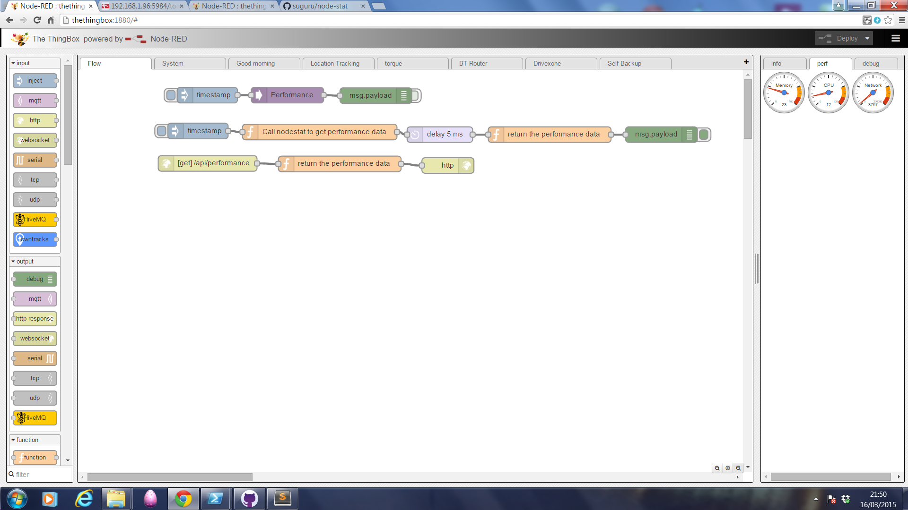

TheThingBoxPerformance
======================

This adds performance dials to TheThingBox

 

You need to 

1. install the node-stat node
2. create the flow below (which calls the node-stat module every 2s and also provides a webservice at /api/performance).
3. add the following files to the node-red `public` folder

```
/public/index.html
/public/performance/gauge.js
/public/red/main.js
/public/red/ui/sidebar.js
/public/red/ui/tab-perf.js
```

